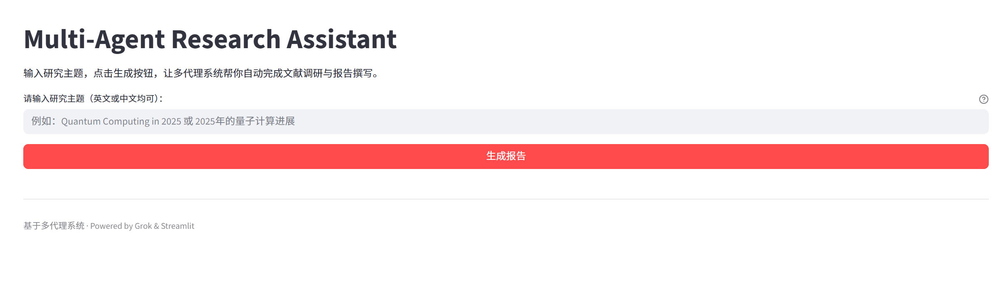
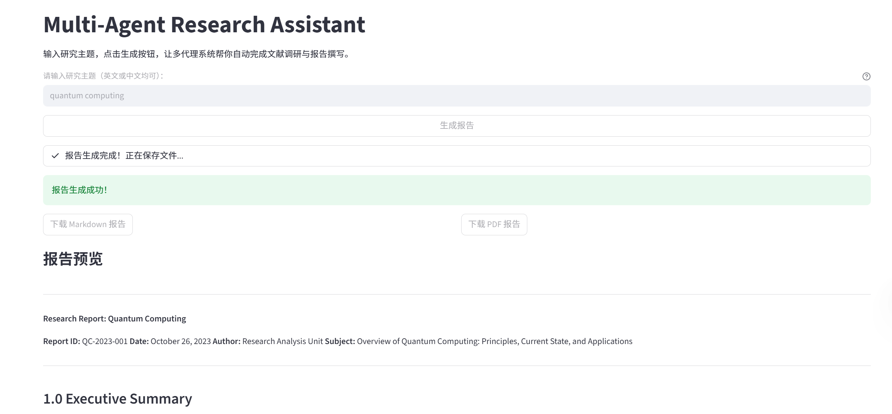

# Multi-Agent Research Assistant

一个基于多代理系统的自动化研究报告生成工具。  
用户只需输入研究主题，系统就会自动规划任务、搜索论文、阅读内容、分析总结并撰写完整报告，支持 Markdown 和 PDF 输出。

初始界面:



完成后的报告预览与下载：



*(以上为实际应用运行截图)*

## 主要功能

- 输入任意研究主题（支持中英文）
- 多代理协作流程：
  - 规划任务 → 搜索学术论文/资料 → 阅读提取关键内容 → 综合分析 → 撰写报告
- 支持 Markdown 格式报告保存
- 一键生成高质量 PDF（使用 Playwright + Chromium 渲染，避免 wkhtmltopdf 常见 bug）
- Streamlit 交互式 Web 界面，实时进度显示 + 下载按钮
- Windows 兼容性优化（asyncio ProactorEventLoopPolicy 处理）

## 技术栈

- **前端/界面**：Streamlit
- **核心代理逻辑**：自定义多代理系统（plan_task, search_agent, reader_agent, analyze, write_report）
- **PDF 生成**：Playwright (Chromium headless) + python-markdown
- **Markdown 转换**：markdown + python-markdown-math（支持 LaTeX 公式）
- **依赖管理**：Python 3.10+ / venv

## 快速开始

### 1. 克隆仓库

```bash
git clone https://github.com/xinyulian053-arch/multi-agent-research-assistant.git
cd multi-agent-research-assistant
```

### 2. 创建并激活虚拟环境（推荐）

```bash
# Windows
python -m venv venv
venv\Scripts\activate

# 或使用 conda（如果你用 Anaconda）
conda create -n research-assistant python=3.11
conda activate research-assistant
```

### 3. 安装依赖

```bash
pip install -r requirements.txt
```

（如果还没有 requirements.txt，可以先运行下面命令生成：）

```bash
pip install streamlit playwright markdown python-markdown-math
playwright install  # 必须执行，下载 Chromium 等浏览器
```

示例 `requirements.txt` 内容（你可以创建这个文件）：

```
streamlit>=1.30.0
playwright>=1.40.0
markdown>=3.5
python-markdown-math>=0.8
# 你的其他依赖，如 langchain, openai 等，根据 main.py 需要添加
```

### 4. 运行应用

```bash
streamlit run web/app.py
```

浏览器会自动打开：http://localhost:8501

输入主题（如 "Quantum Computing Advances 2025" 或 "2025年量子计算进展"），点击“生成报告”即可。

## 项目核心结构

```
multi-agent-research-assistant/
├── main.py                 # 核心代理逻辑和函数定义
├── web/
│   └── app.py              # Streamlit Web 界面
├── utils/
│   └── file_utils.py       # 保存报告、生成 PDF 的工具函数
├── venv/                   # 虚拟环境（gitignore 忽略）
├── quantum_computing_report.md    # 示例生成的报告（gitignore 可选忽略）
└── README.md
```

## 已知问题 & 解决方案

- **PDF 生成失败 / NotImplementedError**  
  Windows 下 asyncio 子进程问题，已在 `file_utils.py` 中强制使用 `WindowsProactorEventLoopPolicy` 解决。

- **PDF 渲染不完整 / 淡化 / 消失**  
  已放弃 wkhtmltopdf，改用 Playwright 渲染，稳定性大幅提升。

- **数学公式不渲染**  
  确保安装 `python-markdown-math`，报告中 LaTeX 内容会通过 MathJax 渲染（HTML 阶段可见）。

- **依赖安装慢**  
  `playwright install` 需要下载 ~300MB 的浏览器文件，建议科学上网或耐心等待。

## 未来计划

- 支持更多代理（如图片/图表生成代理）
- 添加参考文献列表与链接
- 支持导出 Word / LaTeX
- 集成更多搜索源（arXiv API、Google Scholar 等）
- 多语言报告生成优化

## 贡献

欢迎 PR、issue 或 fork！  
如果你在使用中遇到问题，或有功能建议，请直接在 Issues 中提出。

## License

MIT License

