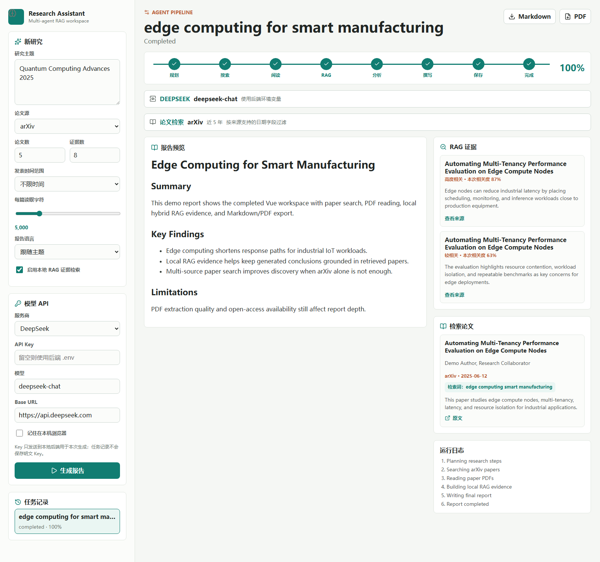

# Multi-Agent Research Assistant

一个面向论文调研和研究报告生成的多代理工作台。项目已从 Streamlit 迁移到 **Vue + FastAPI**，支持开放论文源检索、PDF 内容读取、本地混合 RAG 证据检索、LLM 分析写作，以及 Markdown/PDF 导出。




## 核心能力

- **Vue 研究工作台**：主题输入、论文源选择、时间范围过滤、模型 API 设置、任务记录、进度时间线、日志、报告预览和下载入口。
- **前端填写 API Key**：支持 DeepSeek、OpenAI，以及自定义 OpenAI-compatible 服务；也可以留空，改用后端 `.env`。
- **多论文源检索**：内置 arXiv、Semantic Scholar、Europe PMC、Crossref、综合开放源。
- **中文主题优化**：中文主题会优先转成英文论文检索词，减少 arXiv 等英文论文源搜不到的问题。
- **时间范围过滤**：支持不限时间、近 1 年、近 2 年、近 3 年、近 5 年。
- **本地混合 RAG**：使用哈希向量 + FAISS + BM25 + 查询词覆盖率排序，不依赖远程 embedding API。
- **LLM 响应缓存**：相同 prompt 会命中本地缓存，减少重复 API 调用。
- **兜底报告**：未配置可用 API Key 时，也能生成抽取式 Markdown 报告。
- **一键启动**：Windows 下可直接双击 `start.bat`。

## 快速开始

### 一键启动

Windows 用户直接双击：

```text
start.bat
```

脚本会自动检查依赖并启动：

- 前端：http://127.0.0.1:5173
- 后端：http://127.0.0.1:8000

停止服务：

```text
stop.bat
```

运行日志在 `runtime_logs/`，生成报告在 `generated_reports/`。

### 手动启动

后端：

```powershell
venv\Scripts\python.exe -m uvicorn api.app:app --reload --host 127.0.0.1 --port 8000
```

前端：

```powershell
cd frontend
npm install
npm run dev
```

访问：

```text
http://127.0.0.1:5173
```

生产式运行：

```powershell
cd frontend
npm run build
cd ..
venv\Scripts\python.exe -m uvicorn api.app:app --host 127.0.0.1 --port 8000
```

构建后 FastAPI 会自动挂载 `frontend/dist`。

## 前端参数说明

| 参数 | 作用 |
| --- | --- |
| 研究主题 | 你要调研的主题。中文主题会优先尝试转换为英文检索词。 |
| 论文源 | 选择从哪个开放论文数据库检索；`综合开放源` 会查询多个来源并去重。 |
| 论文数 | 最多保留多少篇检索结果。数量越大越全面，但 PDF 读取会更慢。 |
| 证据数 | RAG 最多返回多少条证据片段给分析和写作代理使用。 |
| 发表时间范围 | 按来源支持的日期字段过滤论文时间，例如近 1 年、近 2 年。 |
| 每篇读取字符 | 每篇 PDF 最多抽取多少字符进入分析流程。调高会提供更多上下文，也会变慢。 |
| 报告语言 | `跟随主题` 会尽量按主题语言输出，也可以强制中文或英文。 |
| 启用本地 RAG | 开启后会从论文正文中检索相关证据，报告更扎实；关闭后直接基于抽取文本生成。 |
| 模型 API | 在前端填写 DeepSeek、OpenAI 或兼容 OpenAI 协议服务的信息。 |

## 论文源说明

| 来源 | 覆盖范围 | 适合场景 | PDF/RAG 友好度 |
| --- | --- | --- | --- |
| arXiv | 计算机、AI、数学、物理、统计、电子工程等预印本 | AI、CS、工程、量子、数学等主题 | 高，通常有 PDF |
| Semantic Scholar | 跨学科论文图谱 | 泛主题探索、找相关论文 | 中，部分有开放 PDF，可能被限流 |
| Europe PMC | 生命科学、医学、药学、公共卫生 | 生物医学主题 | 中高，部分有全文/PDF |
| Crossref | 跨学科 DOI 元数据 | 找正式出版论文、DOI、题录 | 低，不保证 PDF |
| 综合开放源 | 多源查询并去重 | 不确定该用哪个来源时 | 混合 |

还可以继续扩展 OpenAlex、CORE、PubMed/PubMed Central、bioRxiv、medRxiv、DOAJ、HAL、DBLP、OpenReview 等来源。部分来源需要额外 API Key 或更偏特定学科。

## RAG 机制

本项目的 RAG 是本地检索增强生成流程：

1. 搜索论文并读取 PDF 文本。
2. 将论文正文切成带重叠的小片段。
3. 把标题、摘要、检索词和正文片段组成检索文本。
4. 使用哈希向量 + FAISS 召回候选片段。
5. 使用 BM25 和查询词覆盖率增强排序。
6. 将最相关证据交给分析代理和写作代理。

前端显示的相关度是本轮检索内的归一化混合分数，例如：

```text
高度相关 · 本次相关度 87%
较相关 · 本次相关度 63%
```

它比原始向量内积分数更适合用户理解，但仍然是“证据片段相关度”，不是整篇论文的绝对学术价值评分。

## API Key 与缓存

推荐在前端“模型 API”面板填写：

- 服务商：`DeepSeek` / `OpenAI` / `自定义 OpenAI-compatible`
- API Key：你的模型服务 Key
- 模型：例如 `deepseek-chat`、`gpt-4o-mini`
- Base URL：DeepSeek 默认 `https://api.deepseek.com`，OpenAI 可留空，自定义服务必填

前端输入的 Key 只发送到本地 FastAPI 后端用于本次生成；任务记录不会保存明文 Key。若勾选“记住在本机浏览器”，Key 会保存在当前浏览器的 localStorage 中。

也可以复制 `.env.example` 为 `.env`：

```env
DEEPSEEK_API_KEY=your_deepseek_api_key_here
DEEPSEEK_MODEL=deepseek-chat

OPENAI_API_KEY=your_openai_api_key_here
OPENAI_MODEL=gpt-4o-mini

CUSTOM_LLM_API_KEY=your_custom_provider_key_here
CUSTOM_LLM_MODEL=your-custom-model
```

项目包含两层缓存：

- **服务商 prompt cache**：由 DeepSeek/OpenAI 等服务端根据重复前缀自动命中，主题、论文正文、RAG 证据变化都会降低命中率。
- **本地响应缓存**：按 provider、model、base URL、system prompt、temperature、完整 prompt 生成哈希；完全相同请求会直接复用本地结果。

本地缓存默认开启，保存在：

```text
runtime_cache/llm/
```

关闭本地缓存：

```env
LLM_RESPONSE_CACHE=0
```

自定义缓存目录：

```env
LLM_CACHE_DIR=D:\your_cache_dir
```

## 工作流


```mermaid
flowchart LR
    A["用户输入主题和参数"] --> B["规划代理"]
    B --> C["开放论文源检索"]
    C --> D["PDF 下载与文本抽取"]
    D --> E["本地混合 RAG"]
    E --> F["分析代理"]
    F --> G["写作代理"]
    G --> H["Markdown / PDF 导出"]
```

## 项目结构

```text
multi-agent-research-assistant/
├── api/                    # FastAPI 后端
├── agents/                 # 规划、检索、阅读、RAG、分析、写作代理
├── frontend/               # Vue + Vite 前端
├── tools/                  # 论文源检索、PDF 读取
├── utils/                  # 报告保存与 PDF 导出
├── vectorstore/            # 本地向量与混合检索
├── images/                 # README 截图
├── generated_reports/      # 运行时生成，已 gitignore
├── runtime_logs/           # 运行日志，已 gitignore
├── start.bat / stop.bat    # 一键启动/停止
└── requirements.txt
```

## API 概览

- `GET /api/health`：健康检查。
- `POST /api/reports`：创建报告任务。
- `GET /api/reports`：查看当前进程内任务列表。
- `GET /api/reports/{job_id}`：查看任务进度和结果。
- `GET /api/reports/{job_id}/download/markdown`：下载 Markdown。
- `GET /api/reports/{job_id}/download/pdf`：下载 PDF。

## 常见问题

### 搜不到论文

- 中文主题会自动尝试转英文，但过于口语化的主题仍可能匹配差。
- arXiv 更适合理工和预印本，医学主题建议使用 Europe PMC。
- Crossref 主要是 DOI 元数据，不保证有 PDF。
- 网络代理异常时，项目会自动尝试直连回退。

### PDF 读不到内容

- 论文源可能没有开放 PDF。
- PDF 可能是扫描版，普通文本抽取无法读取。
- Crossref 这类题录源通常没有直接 PDF。

### RAG 分数看起来变化大

RAG 分数是本轮证据片段的相对相关度。它用于排序证据，不等于整篇论文的质量评分。

### API 缓存命中低

服务商 prompt cache 依赖重复前缀。论文正文和 RAG 证据每次变化都会降低命中率；本项目的本地响应缓存可以避免完全相同请求重复调用 API。

## 注意事项

- arXiv 搜索、PDF 下载和 LLM 调用需要网络。
- PDF 导出需要 Playwright Chromium：`playwright install chromium`。
- 任务记录保存在当前后端进程内，重启服务后不会保留历史任务状态，但生成文件仍在 `generated_reports/`。
- 旧的 `web/app.py` Streamlit 入口只保留迁移提示；主界面请使用 Vue。

## 未来计划

- 接入更多论文源和可选论文源 API Key。
- 支持更强的本地/远程 embedding 模型。
- 支持 Word、LaTeX、BibTeX 导出。
- 增加更细粒度的引用追踪和证据高亮。

## License

MIT License
