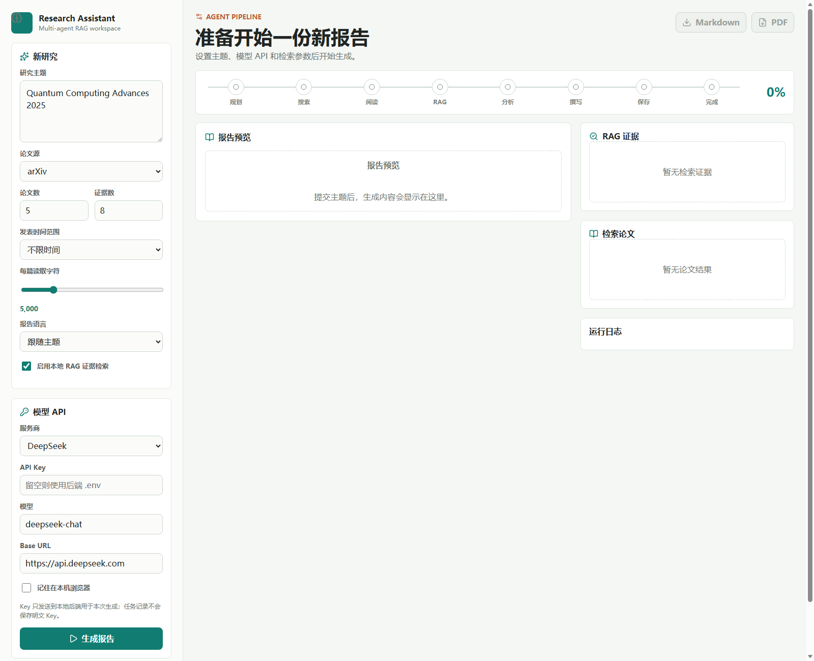
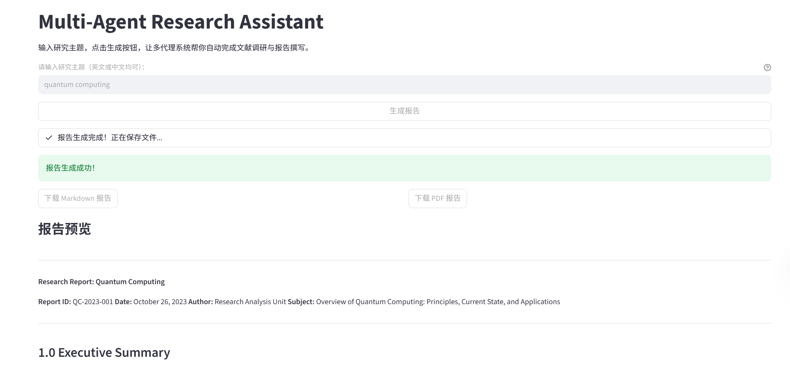

# Multi-Agent Research Assistant

一个基于多代理流程的自动化研究报告生成工具。前端使用 Vue，后端使用 FastAPI，支持开放论文源搜索、PDF 阅读、本地 RAG 证据检索、LLM 分析写作，以及 Markdown/PDF 导出。

初始界面:



完成后的报告预览与下载：



*(以上为实际应用运行截图)*

## 主要功能

- Vue 研究工作台：主题输入、检索参数、模型 API 设置、任务记录、实时进度、日志、报告预览、下载入口。
- 前端填写 API Key：支持 DeepSeek、OpenAI，以及自定义 OpenAI-compatible 服务。
- 论文源选择：支持 arXiv、Semantic Scholar、Europe PMC、Crossref、综合开放源。
- 论文时间范围过滤：支持不限时间、近 1 年、近 2 年、近 3 年、近 5 年。
- FastAPI 后端：异步任务式报告生成，支持轮询任务状态。
- 多代理流水线：规划 -> arXiv 搜索 -> PDF 阅读 -> RAG 证据检索 -> 分析 -> 报告撰写。
- 本地 RAG：使用哈希向量 + FAISS + BM25 混合排序，对论文分块后检索最相关证据，不依赖远程 embedding 服务。
- 兜底报告：未配置 API Key 时仍可生成抽取式 Markdown 报告。
- 一键启动：Windows 下可直接双击 `start.bat`。

## 前端参数说明

- 研究主题：你要调研的主题。中文主题会优先尝试转换成英文检索词，以便 arXiv 返回结果。
- 论文源：选择从哪个开放论文数据库检索；`综合开放源` 会依次查询多个开放来源并去重。
- 论文数：最多保留多少篇论文源结果，数量越大越全面，但 PDF 下载和阅读时间也越长。
- 证据数：RAG 从论文内容中挑选多少条相关证据给分析和写作代理使用。
- 发表时间范围：按来源支持的日期字段过滤论文时间；“近 1 年”表示从当前日期向前推 1 年，“不限时间”则不加日期限制。
- 每篇读取字符：每篇 PDF 最多抽取多少字符进入后续分析；调高会给模型更多上下文，但生成速度会变慢。
- 报告语言：`跟随主题` 会按主题语言自动决定；也可以强制中文或英文。
- 启用本地 RAG 证据检索：开启后会把论文分块，并结合向量相似度、BM25 关键词匹配、查询词覆盖率检索最相关内容；关闭后直接基于抽取文本生成。
- 模型 API：可以在前端填写 DeepSeek、OpenAI 或兼容 OpenAI 协议的服务信息；留空 API Key 时会使用后端 `.env` 配置。

## 论文源说明

当前下拉框内置这些不需要额外论文源 API Key 的选项：

- `arXiv`：物理、数学、计算机科学、统计、电子工程等预印本，通常有稳定 PDF。
- `Semantic Scholar`：跨学科论文图谱，覆盖面广，部分记录提供开放 PDF。
- `Europe PMC`：生命科学与医学方向，部分记录有开放全文或 PDF 链接。
- `Crossref`：跨学科 DOI 元数据，适合补充论文题录和 DOI 链接，但不保证可直接下载 PDF。
- `综合开放源`：依次查询以上来源并去重，适合泛主题探索。

其他大型开放或半开放论文源也可以继续扩展：OpenAlex、CORE、PubMed、PubMed Central、bioRxiv、medRxiv、DOAJ、HAL、DBLP、OpenReview 等。其中 OpenAlex、CORE 等通常需要单独申请免费 API Key；DBLP 更偏计算机题录；bioRxiv/medRxiv 更偏生物医学预印本。

## 一键启动

Windows 用户直接双击：

```text
start.bat
```

脚本会启动：

- 前端：http://127.0.0.1:5173
- 后端：http://127.0.0.1:8000

停止服务：

```text
stop.bat
```

运行日志在 `runtime_logs/`，生成报告在 `generated_reports/`。

## API Key 使用方式

推荐在前端“模型 API”面板里填写：

- 服务商：`DeepSeek` / `OpenAI` / `自定义 OpenAI-compatible`
- API Key：你的模型服务 Key
- 模型：例如 `deepseek-chat`、`gpt-4o-mini`
- Base URL：DeepSeek 默认 `https://api.deepseek.com`，OpenAI 可留空，自定义服务必填

前端输入的 Key 只会发送到本地 FastAPI 后端用于本次生成；任务记录不会保存明文 Key。若勾选“记住在本机浏览器”，Key 会保存在当前浏览器的 localStorage 中。

## LLM 缓存说明

项目现在有两层缓存：

- 服务商 prompt cache：DeepSeek、OpenAI 等服务端根据“重复前缀”自动命中。它要求请求前缀高度一致，论文正文、RAG 证据、主题变化都会降低命中率。
- 本地响应缓存：项目会按 provider、model、base URL、system prompt、temperature、完整 prompt 生成哈希，相同请求会直接复用本地结果，避免重复调用 API。

本地缓存默认开启，文件保存在 `runtime_cache/llm/`，不会进入 Git。可以通过环境变量关闭：

```env
LLM_RESPONSE_CACHE=0
```

也可以自定义缓存目录：

```env
LLM_CACHE_DIR=D:\your_cache_dir
```

也可以复制 `.env.example` 为 `.env`，在后端环境中配置：

```env
DEEPSEEK_API_KEY=your_deepseek_api_key_here
DEEPSEEK_MODEL=deepseek-chat

OPENAI_API_KEY=your_openai_api_key_here
OPENAI_MODEL=gpt-4o-mini

CUSTOM_LLM_API_KEY=your_custom_provider_key_here
CUSTOM_LLM_MODEL=your-custom-model
```

## 手动启动

### 后端

```powershell
venv\Scripts\python.exe -m uvicorn api.app:app --reload --host 127.0.0.1 --port 8000
```

健康检查：

```text
http://127.0.0.1:8000/api/health
```

### 前端

```powershell
cd frontend
npm install
npm run dev
```

访问：

```text
http://127.0.0.1:5173
```

### 生产式运行

```powershell
cd frontend
npm run build
cd ..
venv\Scripts\python.exe -m uvicorn api.app:app --host 127.0.0.1 --port 8000
```

构建后 FastAPI 会自动挂载 `frontend/dist`。

## 项目结构

```text
multi-agent-research-assistant/
├── api/                    # FastAPI 后端
├── agents/                 # 多代理流程
├── frontend/               # Vue + Vite 前端
├── tools/                  # arXiv 搜索、PDF 读取
├── utils/                  # 报告保存与 PDF 生成
├── vectorstore/            # 本地 RAG 向量检索
├── generated_reports/      # 运行时生成，已 gitignore
├── start.bat / stop.bat    # 一键启动/停止
└── requirements.txt
```

## API 概览

- `GET /api/health`：健康检查。
- `POST /api/reports`：创建报告任务。
- `GET /api/reports`：查看当前进程内任务列表。
- `GET /api/reports/{job_id}`：查看任务进度和结果。
- `GET /api/reports/{job_id}/download/markdown`：下载 Markdown。
- `GET /api/reports/{job_id}/download/pdf`：下载 PDF。

## 注意事项

- arXiv 搜索和 PDF 下载需要网络。
- PDF 导出需要 Playwright Chromium：`playwright install chromium`。
- 任务记录保存在当前后端进程内，重启服务后不会保留历史任务状态，但生成文件仍在 `generated_reports/`。
- 旧的 `web/app.py` Streamlit 入口只保留迁移提示；主界面请使用 Vue。
- **数学公式不渲染**  
  确保安装 `python-markdown-math`，报告中 LaTeX 内容会通过 MathJax 渲染（HTML 阶段可见）。

- **依赖安装慢**  
  `playwright install` 需要下载 ~300MB 的浏览器文件，建议科学上网或耐心等待。

## 未来计划

- 支持更多代理（如图片/图表生成代理）
- 支持导出 Word / LaTeX
- 集成更多搜索源（arXiv API、Google Scholar 等）
- 多语言报告生成优化

## 贡献

欢迎 PR、issue 或 fork！  
如果你在使用中遇到问题，或有功能建议，请直接在 Issues 中提出。
觉得有用可以给作者点个star喔,感谢感谢

## License

MIT License
